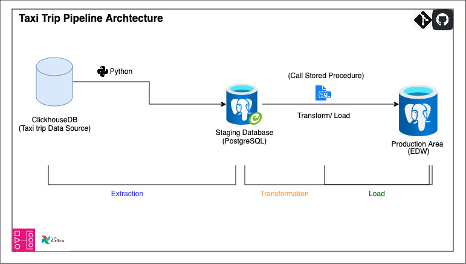

# Taxi Trips ETL Orchestration 

## Overview
- This project used modular coding to systematically define an ETL job with seperate and well defined logic.
- this architecture extracts data from the source (clickhouse), writes to a csv file, then load to a staging environment. from a staging environment
- The data in the staging environment is aggregated and transformed to an enterprise data warehouse using SQL procedure. 
- Aggregated data in the EDW schema is ready to be used for all necessary analytics and reporting.

### Dataset

- `https://github.demo.trial.altinity.cloud`
{username : 'demo' , password : 'demo'}

# Steps

### 1. Module `db_utils.py` 

In this module, three functions are defined. 
- i. The `get_client()` function that connects to clickhouse which is the data source and return a database client object
- ii. The `get_postgres_engine()` function that constructs a SQLalchemy engine object. It creates connection to posgresSQL database where the extracted data is staged(loaded).
- iii. The `get_postgres_engine2()` is a backup postgres database connection for macOS users when they encounter errror creating sqlalchemy.engine due to how postgreSQL is configured to use  Unix domain socket TCP/IP.

### 2. Module `extract_clickhouse.py`
This module house a function `fetch_data(client, query)` that defines the logic that extracts data from the source. This function takes two parameters. The client (connection to source database) and query (sql statement defining the data needed from the source database)

The 'result' is output of the query, and it is returned in rows and columns. It uses 'result_rows' and 'column_names' which are both method on the 'result' object  to return rows and columns of data extracted.

The 'result' is written to a csv file waiting to be loaded to a staging area.

### 3. Module `load_to_staging,py`

This module contains a function that defines the logic for loading the extracted data incrementally into a staging table on a postgres database.

### 4. `Test` directory
The test directory conatians modular and manual testing for the modules of the project. These tests are to verify the code in the staging part of the project.

### 5. The `main.py`: The Pipeline
The `main.py` defines house the logic of the pipeline.
- The pipeline fetches data from source database(clickhouse) as a query result and save to csv from a dataframe
- Loads the data from a csv file directly to a staging table 'tripdata' on postgres using sqlachemy.engine
- Exceute stored procedure that transform data and save output aggregate to Enterprise Datawarehouse for production use.
- Performs an incremental loading to the staging table 

# Production part of the project

The production stage is where the transformation happens and data collected are aggregated.
- `daily_agg_tripdata` is a table in the `EDW` schema of the datawarehouse. The table will house the daily aggreagte of data useful for analysis and report for the business.
- `daily_agg_tripdata_channel` is also a table in the `EDW` schema and house daily aggregate for payment channel

## Procedures for aggregates 
The procedure is created in the staging area which is in the `stg` schema of the database. 
Quick One: I am leaving it in the staging as analysts or other stakeholders does not need to see it.  
The procedure  `agg_tripsdata()` handles three tthings :
- i. `daily_agg_tripsdata`: The procedure aggregates the daily_aggregate_trips data and INSERT result into the `daily_agg_tripsdata` table in the production area.
- ii. `daily_agg_tripsdata_channel`: This part of the procedure aggregates the data for payment channel in the production area
- iii. `procedure_logs`: The procedures handle EXCEPTION and logs error or stutus of the procedure anytime it is called or run.
    This is done so status of the procedure can be properly monitored in case there is any error.

#### The Procedure
To call the procedure which transforms the data and output aggregates, `sessionmaker` is imported from `sqlalchemy.orm` to create a sessi
`from sqlalchemy.orm import sessionmaker`
`CALL "stg".agg_tripsdata();` can now be added to the script `main.py` which is the pipeline 

